<div align="center">
  <h1>
    Course Tracker - Learning Management & Progress Tracker
  </h1>
  <h3>A Modern App for Tracking Your Courses and Learning Progress</h3>
</div>

## 📸 Banner
<p align="center">
    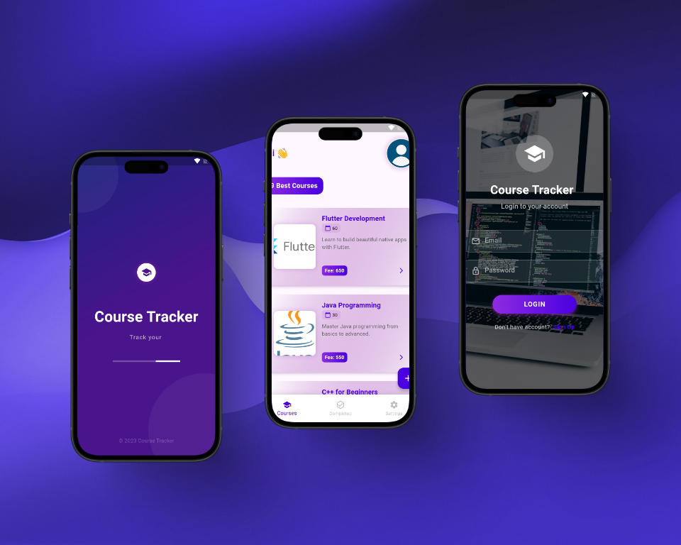
</p>

<p align="center">
    
    
    
</p>

## 📸 Screenshots

### Welcome & Authentication

<table border="1">
  <tr>
    <td align="center">
      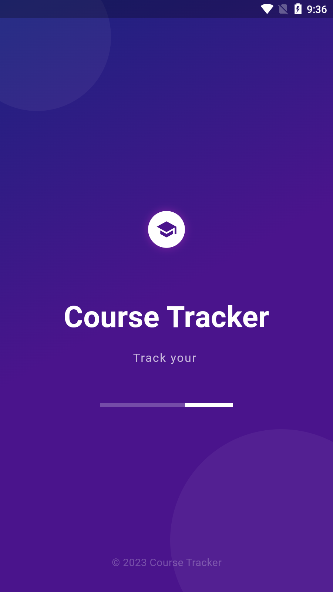
      <p><b>Splash Screen</b></p>
    </td>
    <td align="center">
      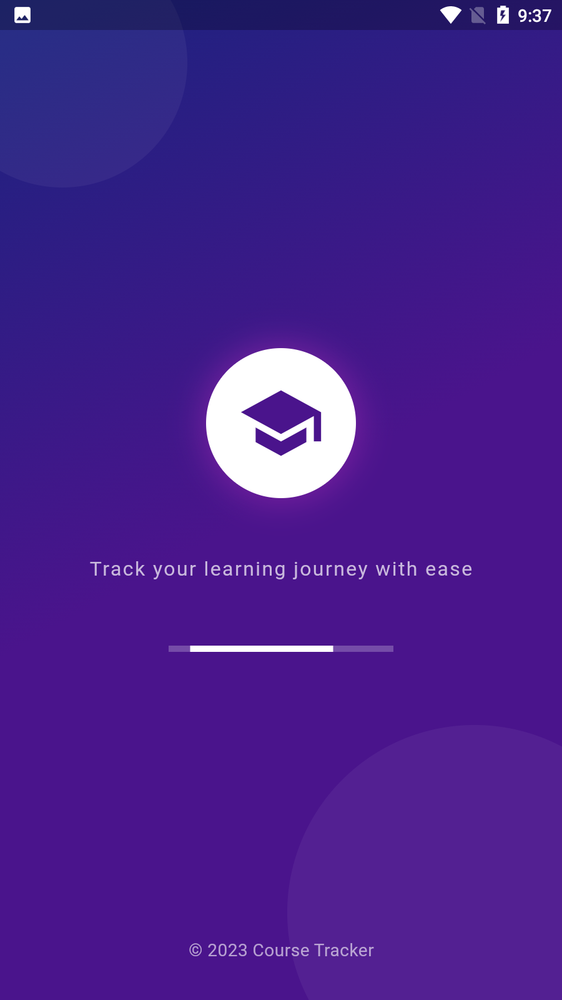
      <p><b>Splash Animation</b></p>
    </td>
    <td align="center">
      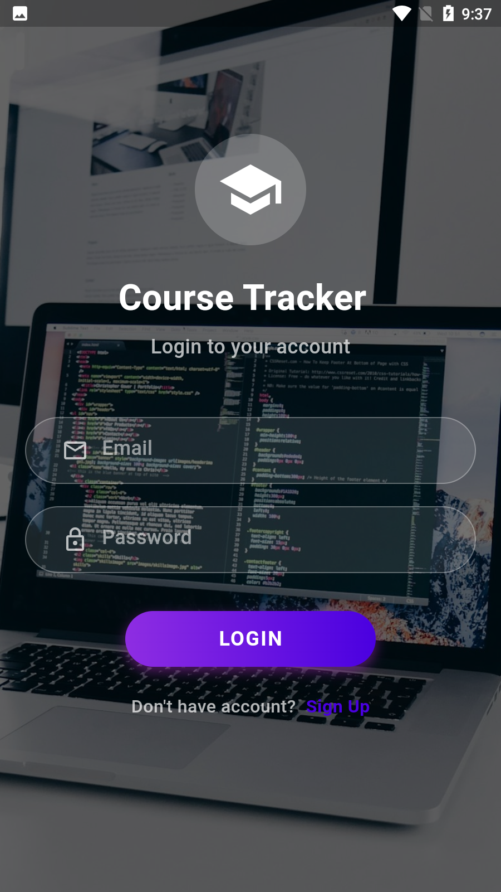
      <p><b>Login Screen</b></p>
    </td>
  </tr>
  <tr>
    <td align="center">
      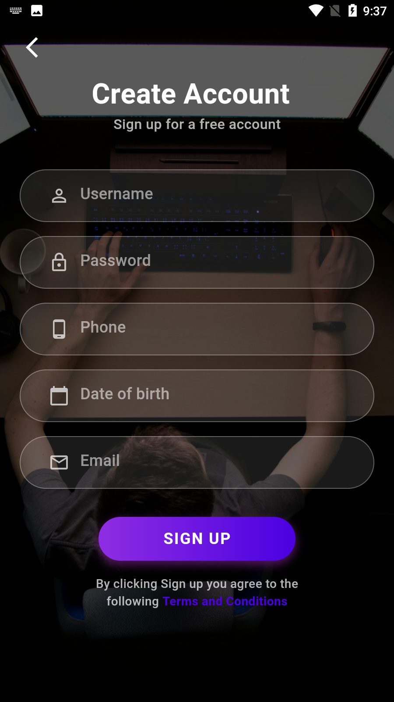
      <p><b>Sign Up Screen</b></p>
    </td>
    <td align="center">
      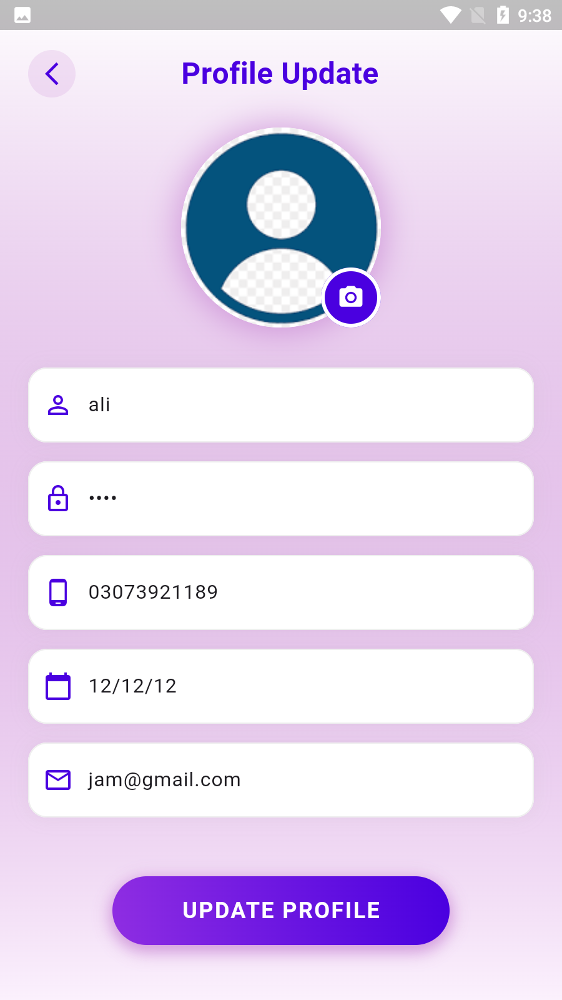
      <p><b>Profile Update</b></p>
    </td>
    <td align="center">
      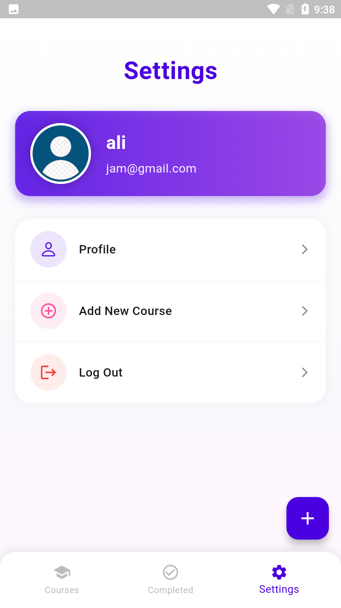
      <p><b>Settings</b></p>
    </td>
  </tr>
</table>

### Main Features

<table border="1">
  <tr>
    <td align="center">
      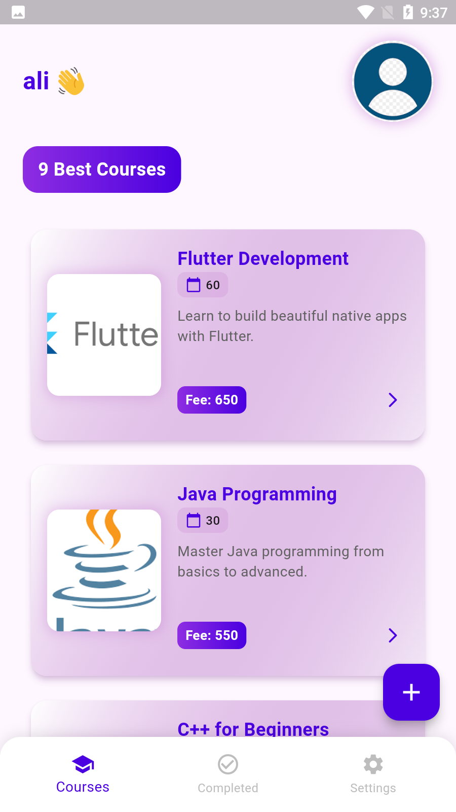
      <p><b>Home Page</b></p>
    </td>
    <td align="center">
      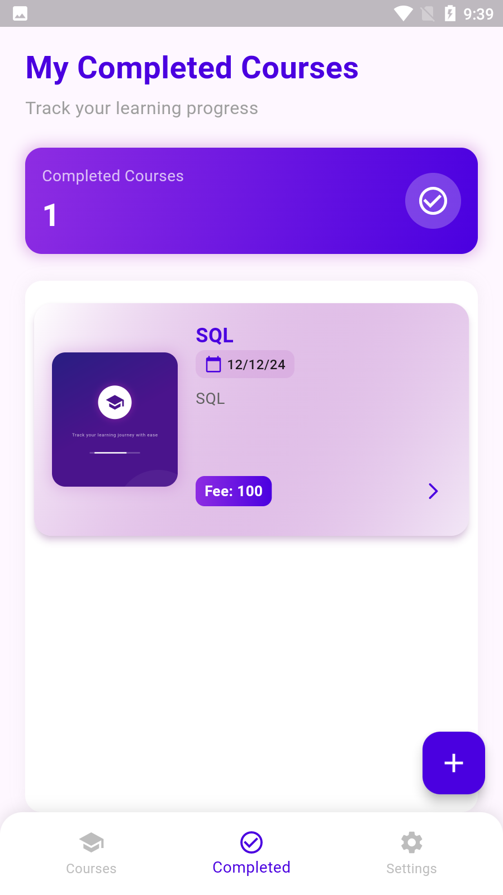
      <p><b>My Courses</b></p>
    </td>
    <td align="center">
      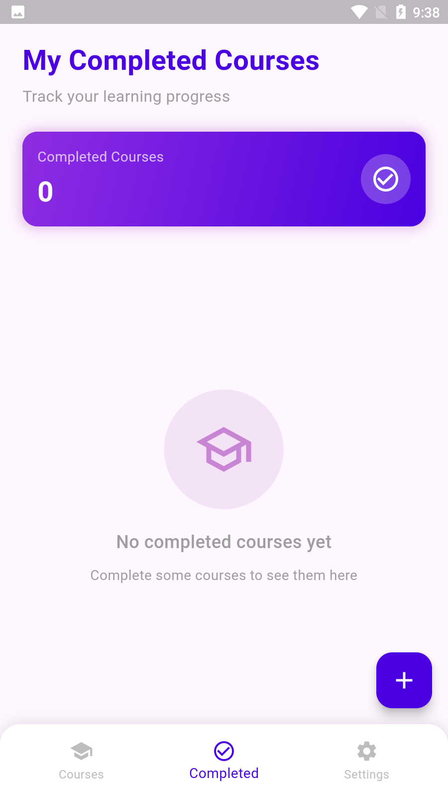
      <p><b>Completed Courses</b></p>
    </td>
  </tr>
  <tr>
    <td align="center">
      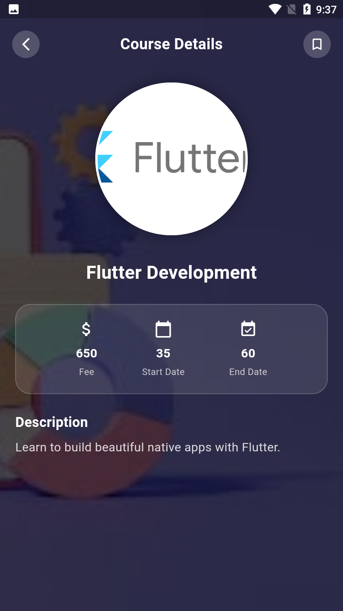
      <p><b>Course Details</b></p>
    </td>
    <td align="center">
      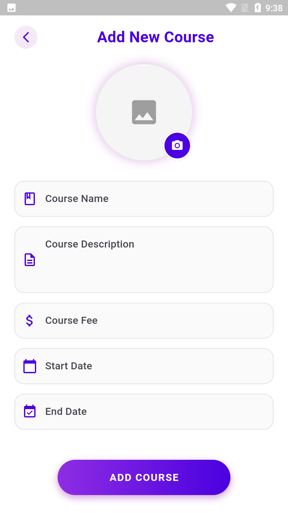
      <p><b>Add New Course</b></p>
    </td>
    <td align="center">
      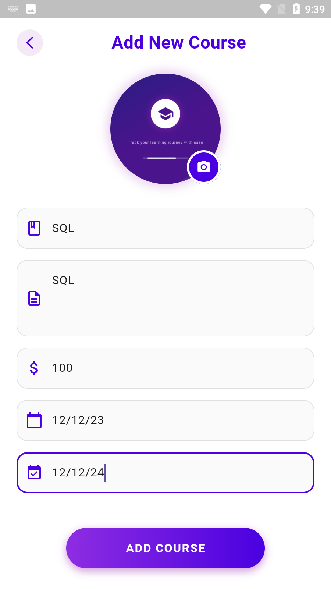
      <p><b>Fill Course Data</b></p>
    </td>
  </tr>
</table>

### Confirmations & Actions

<table border="1">
  <tr>
    <td align="center">
      
      <p><b>Delete Confirmation</b></p>
    </td>
    <td align="center">
      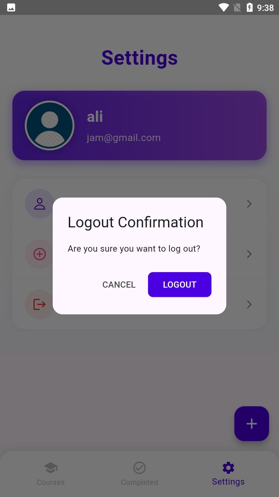
      <p><b>Logout Confirmation</b></p>
    </td>
    <td align="center">
      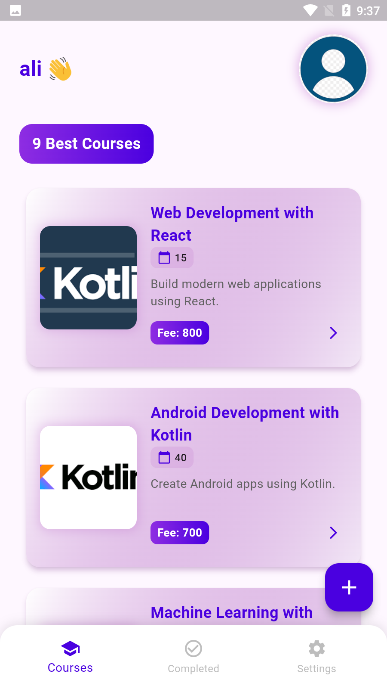
      <p><b>Home Alternate View</b></p>
    </td>
  </tr>
</table>

## 📱 Features

- **Course Management**: Track your courses and learning progress
- **Modern UI**: Beautiful, intuitive interface with animations
- **Authentication**: Secure login and signup system
- **User Profiles**: Create and manage your personal profile
- **Course Details**: View comprehensive information about each course
- **Progress Tracking**: Monitor your learning journey
- **Data Persistence**: Store all your course data locally

## 🚀 Tech Stack

- **Flutter** (UI Framework)
- **GetX** (State Management)
- **SQLite** (Local Database)
- **Shared Preferences** (Local Storage)
- **Flutter Animate** (Animation Library)
- **Material Design 3**
- **Custom Animations**

## 🔑 Key Features

- ✅ **Course Tracking**: Log your courses and learning journey
- ✅ **Progress Monitoring**: Track completion dates and status
- ✅ **Fee Management**: Keep track of course costs
- ✅ **Profile Management**: Customize your user profile
- ✅ **Beautiful UI**: Modern and intuitive interface with animations
- ✅ **Offline Access**: Access your data without internet
- ✅ **Image Support**: Add images to your courses for better organization

## 📖 How to Use

1. **Track Your Courses**
   - Add courses to your dashboard
   - Log start and end dates
   - Track fees and other details

2. **Manage Progress**
   - Mark courses as complete
   - View course completion history
   - Monitor ongoing courses

3. **Update Profile**
   - Change personal information
   - Update profile picture
   - Manage account settings

4. **Organize Courses**
   - View all your courses at a glance
   - Filter by completion status
   - See detailed information about each course

## Project Structure

```
lib/
├── screen/
│   ├── splash_screen.dart
│   ├── login_screen.dart
│   ├── signup_screen.dart
│   ├── home_screen.dart
│   ├── recipe_details_screen.dart
│   ├── addfood.dart
│   ├── profile.dart
│   └── settingScreen.dart
├── model.dart/
│   ├── RecppeModel.dart
│   └── UserModel.dart
├── controller/
│   ├── courseController.dart
│   └── authController.dart
├── widget/
│   ├── theme/
│   │   ├── app_colors.dart
│   │   └── app_theme.dart
│   ├── constants/
│   │   ├── strings.dart
│   │   └── assets.dart
│   └── loaded_recipes_widget.dart
├── sql/
│   └── sqllite.dart
└── main.dart
```

## 📝 License

This project is licensed under the MIT License - see the LICENSE file for details.
